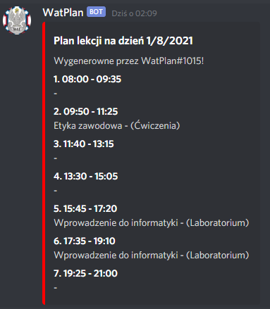

# Discord WAT Schedule Bot

## Setup

1. [Click and add bot to your server](https://discord.com/oauth2/authorize?client_id=778719633250320414&scope=bot)
2. Create channel named: `wat-plan-xyz` where `xyz` is your group id (for example `wcy20iy1s1`)
3. That's all!

## How it works?

Every morning, the bot checks the WAT schedule and displays a message on a special channel. If the day is free from classes, the bot deletes the previous message.
